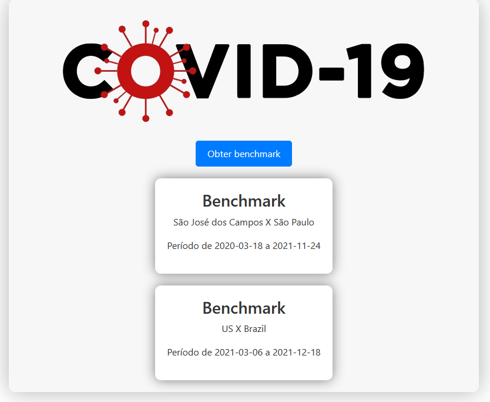
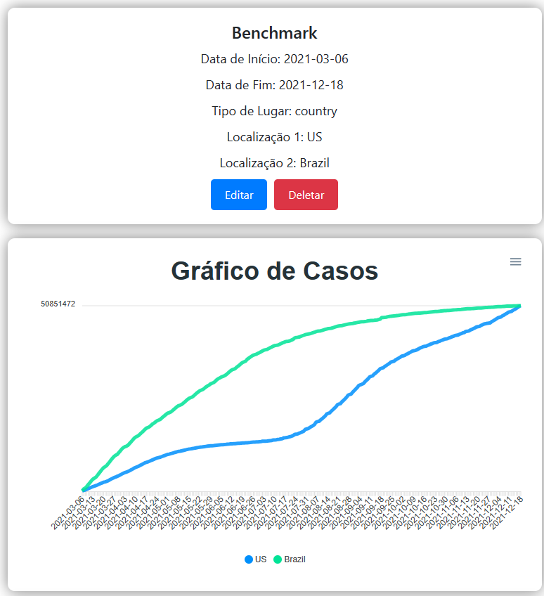
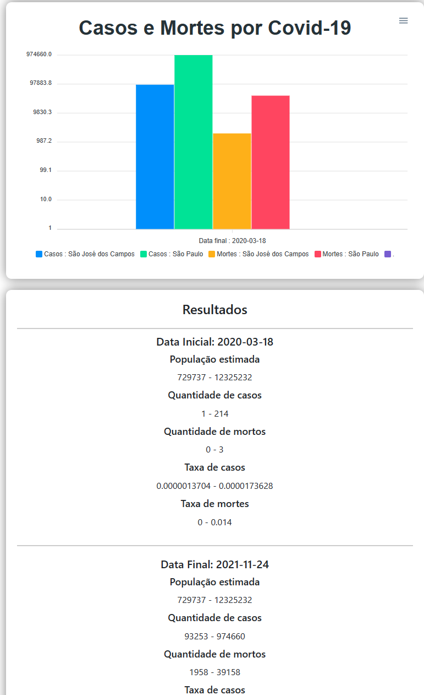

# Benchmark sobre Covid-19 [Frontend]

## 📃 Introdução

A aplicação visa consumir rotas de API do servidor para realizar operações CRUD de benchmarks referentes à Covid-19 entre países ou cidades/estados. Além disso, a aplicação fornece dados estatísticos e gráficos sobre benchmarks de alguma localidade em relação ao Covid-19 .

Para a produção de uma benchmark, a seguinte API setada em .env.development é consumida para coleta de informações:
 - [Servidor] http://localhost:8080/api/benchmark

## 💻 Tecnologias usadas:

- #### Linguagem: Javascript

- React.JS (Biblioteca Javascript para desenvolvimento de UI)
- Vite.JS (Framework para desenvolvimento WEB)
- ApexCharts (Biblioteca para geração de gráficos)
- Docker-Compose (Execução da Aplicação e do Banco de Dados em contêineres)

## 💾 Instalações
Há 2 maneiras diferentes para execução da aplicação, através do docker ou localmente: 
 - **Docker** : Para execução de maneira mais simples da aplicação é necessário ter instalado a ferramenta [docker-compose](https://docs.docker.com/compose/install/). 
 - **Localmente** : Para execução local da aplicação é necessário ter instalado o [Node.js](https://nodejs.org/en/download)

## 💿 Rodando a aplicação

**Docker** : Para iniciar a aplicação utilizando docker, apenas utilize o comando:

    $ docker-compose up -d
**Local** : Para iniciar a aplicação localmente, utilize o comando:

    $ npm i
    $ npm run dev
    

## 🔗 Rotas Consumidas
Path                                | Método |  Descrição
----------------------------------- | ------ | -----
/api/benchmark                      |  GET   |  Retorna todos os registros de Benchmarks
/api/benchmark/:id                  |  GET   |  Retorna o registro de uma Benchmark a patir de sua ID
/api/benchmark/id                   |  GET   |  Retorna a ID de uma Benchmar a partir dos parametros
/api/benchmark                      |  POST  |  Inseri o registro de uma Benchmark
/api/benchmark/:id                  |  PUT   |  Altera dados de uma Benchmark
/api/benchmark/:id                  | DELETE |  Exclui o registro de uma Benchmarks a patir de sua ID
/api/benchmark/:id/result/citystate |  GET   |  Retorna o resultado de uma Benchmark entre cidades ou estados
/api/benchmark/:id/result/country   |  GET   |  Retorna o resultado de uma Benchmark entre países

## 📖 Projeto

 ### HomePage

 ### BenchmarkPage
 - #### Benchmark de um país

 - #### Benchmark de uma cidade

## 💡 Possíveis pontos de avanço

- Refatoração do código para Typescript
- Criação de classes de test
- Organização dos componentes

## ☕ Considerações finais
Este projeto foi criado com doses generosas de café.

[Contato Linkedin](https://www.linkedin.com/in/dev-lucas-marques-sjc/)
