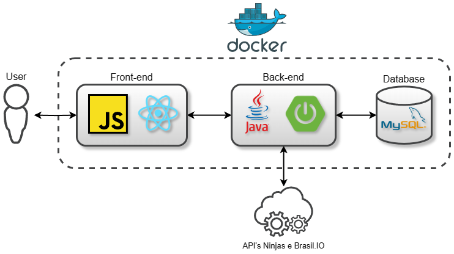

# Benchmark sobre Covid-19 (Fullstack)

## 📃 Introdução
Este projeto oferece uma ferramenta para realizar e salvar comparações (benchmarks) entre países, cidades e estados em relação a dados da Covid-19 desde o ano de 2020. Esses dados incluem informações como quantidade de casos, óbitos, gráficos e outras estatísticas relevantes relacionadas à pandemia.

## 📖 Organização do Projeto
O projeto é dividido em duas pastas:
 - [Backend](Benchmark-Covid-19-Backend) encarregado pela lógica e processamento de dados do benchmark.
 - [Frontend](Benchmark-Covid-19-Frontend) responsável pela apresentação e interação das informações do benchmark para o usuário final.
 - ### Diagrama do Projeto:

 
## 💾 Instalações
Há 2 maneiras diferentes para execução das aplicações, através do docker ou localmente: 
 - **Docker** : Para execução de maneira mais simples das aplicações é necessário ter instalado a ferramenta [docker-compose](https://docs.docker.com/compose/install/). 
 - **Localmente** : Para execução local das aplicações é necessário seguir as instruções README.md das aplicações [backend](Benchmark-Covid-19-Backend/README.md) e [frontend](Benchmark-Covid-19-Frontend/README.md).

## 💿 Rodando as aplicações

**Docker** : Para iniciar as aplicações utilizando docker, utilize o comando:

    $ docker-compose up
## ☕ Considerações finais
Este projeto foi criado com doses generosas de café.

[Contato Linkedin](https://www.linkedin.com/in/dev-lucas-marques-sjc/)
